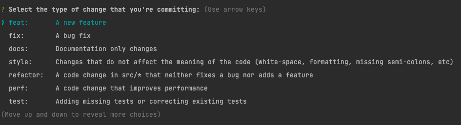

# Contributing to the SniccoWP project

✨ Thanks for your interest in contributing to **SniccoWP**! ✨

As a contributor, here are the guidelines we would like you to follow:

We also recommend that you read [How to Contribute to Open Source](https://opensource.guide/how-to-contribute).

## Table of contents

1. [Questions and Problems](#questions-and-problems)
2. [How can I contribute?](#how-can-i-contribute)
    1. [Improve documentation](#improve-documentation)
    2. [Fix bugs and implement features](#fix-bugs-and-implement-features)
3. [Using the issue tracker](#using-the-issue-tracker)
    1. [Bug Report](#bug-report)
    2. [Feature Request](#feature-request)
4. [Submitting a Pull Request](#submitting-a-pull-request)
5. [Development Environment](#development-environment)
    1. [Setup](#setup)
    2. [Tests](#tests)
    3. [Static Analysis](#static-analysis)
    4. [Linting](#linting)
    5. [Git Hooks](#git-hooks)
6. [Coding rules](#coding-rules)
    1. [Source Code](#source-code)
    2. [Documentation](#documentation)
    3. [Commit Messages](#commit-message-guidelines)
7. [Legal](#legal)

## Questions and Problems

Please do not open issues for general support questions as we want to keep **GitHub** issues for bug reports and feature
requests. You've got much better chances of getting your question answered on dedicated support platforms, the best
being [stackoverflow](https://stackoverflow.com/questions/tagged/sniccowp).

**Stack Overflow** is a much better place to ask questions since:

- there are thousands of people willing to help on **Stack Overflow**
- questions and answers stay available for public viewing so your question / answer might help someone else
- **Stack Overflow's** voting system assures that the best answers are prominently visible.

To save your and our time, we will systematically close all issues that are requests for general support and redirect
people to the section you are reading right now.

## How can I contribute?

### Improve documentation

As a **SniccoWP** user, you are the perfect candidate to help us improve our documentation: typo corrections,
clarifications, more examples, etc. Take a look at
the [documentation issues that need help](https://github.com/sniccowp/sniccowp/issues?q=is%3Aopen+label%3Adocumentation+label%3Ahelp-wanted)
.

Please follow the [documentation guidelines](#documentation).

### Fix bugs and implement features

Confirmed bugs and ready-to-implement features are marked with
the [help wanted label](https://github.com/sniccowp/sniccowp/labels/help-wanted)
. Post a comment on an issue to indicate you would like to work on it and to request help from us and the community.
Look for issues with the [good first issue label](https://github.com/sniccowp/sniccowp/labels/good%20first%20issue) if
you are a first time contributor.

## Using the issue tracker

The issue tracker is the channel for [bug reports](#bug-report), [features requests](#feature-request)
and [submitting pull requests](#submitting-a-pull-request).

Before opening an issue or a pull request, please use
the [GitHub issue search](https://github.com/sniccowp/sniccowp/issues) to make sure the bug or feature request hasn't
been already reported or fixed.

**DO NOT USE THE ISSUE TRACKER TO REPORT SECURITY VULNERABILITIES**

Consult our [security policy](SECURITY.md) instead.

### Bug report

[A good bug report shouldn't leave others needing to chase you for more information](https://tomasvotruba.com/blog/2021/02/01/effective-debug-tricks-narrow-scoping/)
. Please try to be as detailed as possible in your report and fill the information requested in
the [bug report template](https://github.com/semantic-release/semantic-release/issues/new?template=01_bug_report.md).

**! Not following the bug report template will lead to automatic closing of the issue by
our [SniccoWP-Bot](https://github.com/sniccowp-bot).**

### Feature request

Feature requests are welcome, but take a moment to find out whether your idea fits with the scope and aims of the
project. It's up to you to make a strong case to convince the project's developers of the merits of this feature. Please
provide as much detail and context as possible and fill the information requested in
the [feature request template](https://github.com/semantic-release/semantic-release/issues/new?template=02_feature_request.md)
.

## Submitting a Pull Request

Good pull requests, whether patches, improvements, or new features, are a fantastic help. They should remain focused in
scope and avoid containing unrelated commits.

**[Please ask first](#using-the-issue-tracker)** before embarking on any significant pull requests (e.g. implementing
features, refactoring code), otherwise you risk spending a lot of time working on something that the project's
maintainers might not want to merge into the project.

If you have never created a pull request before, welcome 🎉 😄.
[Here is a great tutorial](https://opensource.guide/how-to-contribute/#opening-a-pull-request) on how to send one :)

Here is a summary of the steps to follow:

1. Read the short [legal](#legal) paragraph.
2. Search [GitHub](https://github.com/sniccowp/sniccowp/pulls) for an open or closed pull request that relates to your
   submission. You don't want to duplicate existing efforts.
3. [Fork](https://docs.github.com/en/github/getting-started-with-github/fork-a-repo)
   the [`sniccowp/sniccowp`](https://github.com/sniccowp/sniccowp) repo.
4. [Set up the development environment.](#development-environment)
5. [Clone your for](https://docs.github.com/en/repositories/creating-and-managing-repositories/cloning-a-repository) to
   your local machine.
6. In your forked repository, make your changes in a new git branch:
     ```shell
     # Feature branch
     git checkout -b feature/my-new-feature master
     # Issue branch
   git checkout -b fix/#123 master
     ```
   **Please don't open a pull request from your master branch!**
7. Make your code changes, following the [coding rules.](#coding-rules)
8. Push your branch up to your fork:
     ```shell
     git push origin feature/my-new-feature
     ```
9. [Open a Pull Request](https://help.github.com/articles/creating-a-pull-request/#creating-the-pull-request) with a
   clear description and title that follows the [commit-message guidelines](#commit-message-guidelines)
10. Review the automatic [status checks](https://github.com/sniccowp/sniccowp/actions) for your pull request and adjust
    your code if necessary.

**Tips**:

- [Allow SniccoWP maintainers to make changes to your Pull Request branch](https://help.github.com/articles/allowing-changes-to-a-pull-request-branch-created-from-a-fork)
  . This way, we can rebase it and make some minor changes if necessary. All changes we make will be done in new commit,
  and we'll ask for your approval before merging them.
- **Don't be afraid:** One great thing about our [strict coding rules](#coding-rules) is that it’s very hard to
  introduce any sort of type error in the **SniccoWP** codebase. There are well over 6,000 test assertions, so the risk
  of you messing up (without the CI system noticing) is very small.

## Development environment

### Setup

Before you can build and test the **SniccoWP** repository, you must install have the following software installed on
your development machine:

- [PHP](https://www.php.net/): Either `7.4` | `8.0` | `8.1` as defined in the `composer.json` file.
- Optional: [Node.js + npm](https://nodejs.org/en/), **node.js** is not required to test the source code but will have
  awesome tooling that will make your live much easier while developing.
- Optional: [Mysql + WordPress](https://developer.wordpress.org/cli/commands/core/install/), only if you are making a
  pull request for one of the **WordPress** components.
- Optional: [Redis](https://redis.io/docs/getting-started/)

After cloning the repository to your local machine you can run:

```shell
./bin/install.sh [-w $wp_version]
```

This script will install all dev dependencies (**composer** + **npm**).
If you pass "-w" a preconfigured **WordPress** installation will also be installed. You only need this if you are working on a **WordPress** related component.

### Tests

The project is tested by using both [phpunit](https://github.com/sebastianbergmann/phpunit)
and [codeception](https://github.com/Codeception/Codeception).

**Codeception** is used to test **WordPress** related code. **PHPUnit** is used for everything else.

Tests that depend on **WordPress** code are always inside a `/wordpress` folder inside a package's `/tests` directory.

To run all tests:

```shell
composer tests
```

To run tests for a specific directory in the monorepo:

```shell
composer tests:components
composer tests:bridge
composer tests:bundle
composer tests:middleware
```

To run tests for a specific package:

```shell
# For phpunit tests
vendor/bin/phpunit src/Snicco/Component/kernel

# For codeception tests
vendor/bin/codecept run src/Snicco/Component/better-wpdb/tests
```

### Static analysis

The **SniccoWP** codebase uses [vimeo/psalm](https://github.com/vimeo/psalm) on the strictest level.

To run psalm:

```shell
# Running psalm
composer psalm

# Clearing the cache for psalm
composer psalm:clear-cache
```

### Linting

The **SniccoWP** codebase uses and [symplify/easy-coding-standards](https://github.com/symplify/easy-coding-standard)
and [Rector](https://github.com/rectorphp/rector) to automatically style and refactor its code.

```shell
# Checking for linting errors
composer lint

# Automatically fixing errors
composer lint:fix
```

### Git Hooks

**SniccoWP** uses [husky](https://github.com/typicode/husky) to automatically
create [git hooks](https://git-scm.com/docs/githooks) when you run the `install.sh` script.

This does not affect any other projects of yours.

Before each commit, your commit message will be [validated](#commit-message-guidelines).

Before each push, `composer:lint` will be executed.

If you want to skip the git hooks you can run your git commands with the `--no-verify` flag. Errors will still be caught
by our CI pipelines.

## Coding rules

### Source code

To ensure the consistency and high quality throughout the source code, all code modifications must have:

- No [linting](#linting) errors.
- A [test](#tests) for every possible case introduced by your code change.
- **100%** test coverage.
- [Valid commit message(s).](#commit-message-guidelines)
- Documentation for new features.
- Updated documentation for modified features.

These rules are automatically validated by our CI pipelines when you open a pull request.

### Documentation

To ensure consistency and quality, all documentation modifications must:

- Refer to brand in [bold](https://help.github.com/articles/basic-writing-and-formatting-syntax/#styling-text) with
  proper capitalization, i.e. **GitHub**, **SniccoWP**, **npm**
- Prefer [tables](https://help.github.com/articles/organizing-information-with-tables)
  over [lists](https://help.github.com/articles/basic-writing-and-formatting-syntax/#lists) when listing key values,
  i.e. List of options with their description
- Use [links](https://help.github.com/articles/basic-writing-and-formatting-syntax/#links) when you are referring to:
    - a **SniccoWP** concept described somewhere else in the documentation, i.e. How to [contribute](CONTRIBUTING.md)
    - a third-party product/brand/service, i.e. Integrate with [GitHub](https://github.com)
    - an external concept or feature, i.e. Create a [GitHub release](https://help.github.com/articles/creating-releases)
    - a package or module, i.e. The [`sniccowp/kernel`](https://github.com/sniccowp/kernel) package
- Use
  the [single backtick `code` quoting](https://help.github.com/articles/basic-writing-and-formatting-syntax/#quoting-code)
  for:
    - commands inside sentences, i.e. the `composer tests` command
    - programming language keywords, i.e. `function`, `method`, `class`
    - packages or modules, i.e. The [`sniccowp/kernel`](https://github.com/semantic-release/github) module
- Use the [triple backtick `code` formatting](https://help.github.com/articles/creating-and-highlighting-code-blocks)
  for:
    - code examples
    - configuration examples
    - sequence of command lines

### Commit message guidelines

We have very precise rules over how our git commit messages can be formatted. This leads to more readable messages that
are easy to follow when looking through the project history.

But also, we use the git commit messages to automatically generate our [changelog](#CHANGELOG.md) and even our releases
are [fully automatic based on the commit messages](https://semantic-release.gitbook.io/semantic-release/).

**DON'T BE SCARED!**

We integrated the wonderful [commitizen](https://github.com/commitizen/cz-cli) **npm** package which provides a
beautiful, interactive cli to create valid commit messages.



You can run either `npm run commit` or `npx cz` to prompt the cli.

#### Atomic commits

If possible, make [atomic commits](https://en.wikipedia.org/wiki/Atomic_commit), which means:

- a commit should contain exactly one self-contained functional change
- a functional change should be contained in exactly one commit
- a commit should not create an inconsistent state (such as test errors, linting errors, partial fix, feature with
  documentation etc...)

A complex feature can be broken down into multiple commits as long as each one maintains a consistent state and consists
of a self-contained change.

#### Commit message format

Each commit message consists of a **header**, a **body** and a **footer**. The header has a special format that includes
a **type**, a **scope** and a **subject**:

```commit
<type>(<scope>): <subject>
<BLANK LINE>
<body>
<BLANK LINE>
<footer>
```

The **header** is mandatory and the scope must be one of the [defined scopes.](/commit-scopes.json)

Multiple scopes can be combined with a `,`. A `*` can be used if a lot of scopes are affected.

The **footer** can contain
a [closing reference to an issue](https://help.github.com/articles/closing-issues-via-commit-messages).

#### Revert

If the commit reverts a previous commit, it should begin with `revert: `, followed by the header of the reverted commit.
In the body it should say: `This reverts commit <hash>.`, where the hash is the SHA of the commit being reverted.

#### Type

The type must be one of the following:

| Type     | Description                                                                                            |
|----------|--------------------------------------------------------------------------------------------------------|
| ci       | Changes to our CI configuration files and scripts                                                      |
| docs     | Documentation only changes                                                                             |
| feat     | A new feature                                                                                          |
| fix      | A bug fix                                                                                              |
| perf     | A code change that improves performance                                                                |
| refactor | A code change in src/Snicco/* that neither fixes a bug nor adds a feature                              |
| style    | Changes that do not affect the meaning of the code (white-space, formatting, missing semi-colons, etc) |
| test     | Adding missing tests or correcting existing tests                                                      |
| chore    | Any other changes that don't modify src or test files (example: changing .gitignore)                   |

#### Subject

The subject contains succinct description of the change:

- use the imperative, present tense: "change" not "changed" nor "changes"
- don't capitalize first letter
- no dot (.) at the end
- must not exceed 72 characters

#### Body

Just as in the **subject**, use the imperative, present tense: "change" not "changed" nor "changes". The body should
include the motivation for the change and contrast this with previous behavior. Each line must not exceed 100
characters.

#### Footer

The footer should contain any information about **Breaking Changes** and is also the place to reference GitHub issues
that this commit **closes**.

**Breaking Changes** should start with the word `BREAKING CHANGE:` with a space or two newlines. The rest of the commit
message is then used for this.

#### Examples

```commit
fix(session): dont rotate an invalidated session
```

```commit
feat(http-routing,http-routing-bundle): allow matching routes by subdomain

Fix #42
```

```commit
feat(kernel): allow passing instantiated bundles to the constructor

BREAKING CHANGE: The constructor now accepts objects instead of strings.

This allows users to configure their bundles before booting the kernel.
```

## Legal

By submitting a pull request, you disavow any rights or claims to any changes submitted to the **SniccoWP** project and
assign the copyright of those changes to Calvin Alkan.

If you cannot or do not want to reassign those rights (your employment contract for your employer may not allow this),
you should not submit a pull request. Open an issue and someone else can do the work.

This is a legal way of saying "If you submit a pull request to us, that code becomes ours". 99.9% of the time that's
what you intend anyways; we hope it doesn't scare you away from contributing.
