# BetterWPCLI - The missing parts to the already awesome [WP-CLI](https://wp-cli.org/)

[](https://codecov.io/gh/snicco/snicco)
[](https://shepherd.dev/github/snicco/snicco)
[](https://psalm.dev/)
[](https://snicco.github.io/snicco/phpmetrics/BetterWPCLI/index.html)


**BetterWPCLI** is a small, zero-dependencies, **PHP** library that helps you build enterprise WordPress command-line
applications.

**BetterWPCLI** does not replace or take over any functionality of the `wp` runner.

Instead, it sits between [WP-CLI](https://wp-cli.org/) and your custom commands.

## Table of contents

1. [Motivation](#motivation)
2. [Installation](#installation)
3. [Usage](#usage)
    1. [Commands](#commands)
        1. [Synopsis](#synopsis)
        2. [Default flags](#default-flags)
    2. [Registering Commands](#registering-commands)
    3. [Console Input](#console-input)
    4. [Console Output](#console-output)
        1. [Verbosity levels](#verbosity-levels)
    5. [Styling command output](#styling-command-output)
        1. [Title](#title)
        2. [Section](#section)
        3. [Info](#info)
        4. [Note](#note)
        5. [Success](#success)
        6. [Warning](#warning)
        7. [Error](#error)
    6. [Interactive input](#interactive-input)
        1. [Asking for confirmation](#asking-for-confirmation)
        2. [Asking for information](#asking-for-information)
        3. [Hidden input](#hidden-input)
        4. [Validating answers](#validating-the-provided-input)
    7. [Exception handling](#exception-handling)
       1. [Uncaught exceptions](#uncaught-exceptions)
       2. [Logging](#logging)
       3. [Converting errors to exceptions](#converting-errors-to-exceptions)
4. [Contributing](#contributing)
5. [Issues and PR's](#reporting-issues-and-sending-pull-requests)
6. [Security](#security)
7. [Credits](#credits)

## Motivation

We developed this library for the **WordPress** related components of the
[**Snicco**](https://github.com/snicco/snicco) project due to the following reasons:

- ❌ [WP-CLI](https://wp-cli.org/) has no native support for dependency-injection and does not support lazy-loading of
  commands.


- ❌ [WP-CLI](https://wp-cli.org/) encourages command configuration in meta language or by hard-coded string names.
    - see [Why Config Coding Sucks](https://tomasvotruba.com/blog/2019/02/14/why-config-coding-sucks/).
    - "Was it `repeating` or was it `multiple`?", "Was it `long_description` or `long_desc`?"


- ❌ [WP-CLI](https://wp-cli.org/) has inconsistent and unconfigurable handling of writing to `STDOUT` and `STDERR`.
    - `WP_CLI::log()`, `WP_CLI::success()`, `WP_CLI::line()` write to `STDOUT`
    - `WP_CLI::warning()` and `WP_CLI::error()` write to `STDERR`.
    - Progress bars are written to `STDOUT` making command piping impossible.
    - Prompts for input are written to `STDOUT` making command piping impossible.
    - Uncaught PHP notices (or other errors) are written to `STDOUT` making command piping impossible.


- ❌ [WP-CLI](https://wp-cli.org/) has no error handling. Thrown exceptions go directly to the global shutdown
  handler (`wp_die`) and show up in the terminal as the
  dreaded `"There has been a critical error on this website.Learn more about troubleshooting WordPress."`
  . Thus, they also go to `STDOUT` instead of `STDER`.


- ❌ [WP-CLI](https://wp-cli.org/) can detect ANSI support only for `STDOUT` and not individually for both `STDOUT`
  and `STDERR`.
    - If you are redirecting `STDOUT` you probably don't want `STDERR` to lose all colorization.


- ❌ [WP-CLI](https://wp-cli.org/) commands are hard to test because its encouraged to use the static `WP_CLI` class
  directly in your command instead of using some  `Input/Output` abstraction.


- ❌ [WP-CLI](https://wp-cli.org/) does not play nicely with static analysers like **psalm** and **phpstan**.
    - You receive two completely untyped arrays in your command classes.
    - You have no easy way of separating positional arguments from repeating positional arguments.

**BetterWPCLI** aims to solve all of these problems while providing you many additional features.

**BetterWPCLI** is specifically **designed to be usable in distributed code** like public plugins.

## Installation

**BetterWPCLI** is distributed via [composer](https://getcomposer.org/).

```shell
composer require snicco/better-wp-cli
```

## Usage

### Commands

All commands extend the [Command](src/Command.php) class.

One [Command](src/Command.php) class is responsible for handling exactly **ONE** command and defining its own synopsis.

The command class reproduces the example command described in
the [WP-CLI commands cookbook](https://make.wordpress.org/cli/handbook/guides/commands-cookbook/#wp_cliadd_commands-third-args-parameter)
.

```php
use Snicco\Component\BetterWPCLI\Command;
use Snicco\Component\BetterWPCLI\Input\Input;
use Snicco\Component\BetterWPCLI\Output\Output;
use Snicco\Component\BetterWPCLI\Synopsis\Synopsis;
use Snicco\Component\BetterWPCLI\Synopsis\InputFlag;
use Snicco\Component\BetterWPCLI\Synopsis\InputOption;
use Snicco\Component\BetterWPCLI\Synopsis\InputArgument;

class ExampleCommand extends Command {
    
    // You can set an explicit command name. 
    // If a command name is not set explicitly, it's determined from the class name.
    protected static string $name = 'example';
    
    
    
    // The short description of the command that will be shown
    // when running "wp help example"
    protected static string $short_description = 'Prints a greeting'
    
    
    
    // If a long description is not set explicitly it will default to 
    // the short_description property.
    protected static string $long_description = '## EXAMPLES' . "\n\n" . 'wp example hello Newman'
    
    
    
    public function execute(Input $input, Output $output) : int {
        
        $name = $input->getArgument('name'); // (string) Always a string
        $type = $input->getOption('flag'); // (string) Always a string
        $honk = $input->getFlag('honk'); // (bool) Always a boolean
        
        // outputs a message followed by a "\n"
        $output->writeln("$type: Hello $name!");
        
        // Writes directly to the output stream without newlines
        //$output->write('You are about');
        //$output->write(' to honk');
        
        // Writes to "\n" chars
        //$output->newLine(2);
        
        if($honk) {
            $output->writeln("Honk");
        }
        
        // (This is equivalent to returning int(0))
        return Command::SUCCESS;

        // (This is equivalent to returning int(1))
        // return Command::FAILURE;

        // (This is equivalent to returning int(2))
        // return Command::INVALID
    }
    
    
    public static function synopsis() : Synopsis{
      
      return new Synopsis(
            new InputArgument(
                'name', 
                'The name of the person to great', 
                InputArgument::REQUIRED
            ),
            
            // You can combine options by using bit flags.
            
            // new InputArgument(
            //    'some-other-arg', 
            //    'This is another arg', 
            //    InputArgument::REQUIRED | InputArgument::REPEATING
            //),
            
            new InputOption(
                'type', 
                'Whether or not to greet the person with success or error.', 
                InputOption::OPTIONAL, 
                'success',
                ['success', 'error']
            ),
            new InputFlag('honk')
      );
      
    }
    
}
```

---

#### Synopsis

The [`Synopsis`](src/Synopsis/Synopsis.php) value object helps you to create the
command synopsis using a clear **PHP** API.

The [`Synopsis`](src/Synopsis/Synopsis.php) has a rich set of validation rules
that are only implicit in the [WP-CLI](https://wp-cli.org/). This helps you prevent certain gotchas right away like:

- Having duplicate names for arguments/options/flags.
- Registering a positional argument after a repeating argument.
- Setting a default value that is not in the list of allowed values.
- ...

A [`Synopsis`](src/Synopsis/Synopsis.php) consists of zero or more positional arguments, options or flags.

These a represented by their respective classes:

- [`InputArgument`](src/Synopsis/InputArgument.php)
- [`InputOption`](src/Synopsis/InputOption.php)
- [`InputFlag`](src/Synopsis/InputFlag.php)

---

#### Default flags

The [`Command`](src/Command.php) class has several inbuilt flags that you can use in your commands.

You can automatically add them to all your commands by adding them to the parent synopsis.

This is totally optional.

```php

use Snicco\Component\BetterWPCLI\Command;
use Snicco\Component\BetterWPCLI\Synopsis\Synopsis;
use Snicco\Component\BetterWPCLI\Synopsis\InputArgument;

class MyCommand extends Command {

    public static function synopsis() : Synopsis{
        return parent::synopsis()->with([
            new InputArgument(
                'name', 
                'The name of the person to great', 
                InputArgument::REQUIRED
            ),
        ]);
    }
}

```

This will add the following command synopsis:


---

### Registering commands

Commands are registered by using the [`WPCLIApplication`](src/WPCLIApplication.php) class.

```php
if(!defined('WP_CLI')) {
    return;
}

use Snicco\Component\BetterWPCLI\WPCLIApplication;
use Snicco\Component\BetterWPCLI\CommandLoader\ArrayCommandLoader;

// The namespace will be prepended to all your commands automatically.
$command_namespace = 'snicco';

// The command loader is responsible for lazily loading your commands.
// The second argument is a callable that should return an instance of
// a command by its name. This should typically be a call to your dependency injection container.

// This array can come from a configuration file.
$command_classes = [
    ExampleCommand::class,
    FooCommand::class,
    BarCommand::class,
];

$container = /* Your dependency injection container or another factory class */
$factory = function (string $command_class) use ($container) {
    return $container->get($command_class);
}

$command_loader = new ArrayCommandLoader($command_classes, $factory);

$application = new WPCLIApplication($command_namespace);

$application->registerCommands();
```

---

### Console Input

Console input is abstracted away through an [`Input`](src/Input/Input.php) interface.

All commands will receive an instance of [`Input`](src/Input/Input.php) that holds all the passed arguments.

```php
use Snicco\Component\BetterWPCLI\Input\Input
use Snicco\Component\BetterWPCLI\Output\Output
use Snicco\Component\BetterWPCLI\Synopsis\Synopsis;
use Snicco\Component\BetterWPCLI\Synopsis\InputFlag;
use Snicco\Component\BetterWPCLI\Synopsis\InputOption;
use Snicco\Component\BetterWPCLI\Synopsis\InputArgument;

// ...
public static function synopsis(): Synopsis
{
    return new Synopsis(
        new InputArgument(
            'role',
            'The role that should be assigned to the users',
        ),
        new InputArgument(
            'ids',
            'A list of user ids that should be assigned to passed role',
            InputArgument::REQUIRED | InputArgument::REPEATING
        ),
        new InputFlag(
            'notify',
            'Send the user an email about his new role'
        ),
        new InputOption(
            'some-option',
        ),
    );
}

// ...
public function execute(Input $input, Output $output): int
{
    $output->writeln([
        'Changing user roles',
        '===================',
    ]);
    
    // Arguments are retrieved by their name.
    $role = $input->getArgument('role');  // (string)
    
    // The second argument is returned if the option/argument was not passed. 
    $option = $input->getOption('some-option', 'some-default-value'); // (string)
    
    $users = $input->getRepeatingArgument('ids'); // (string[]) and array of ids.
    
    $notify = $input->getFlag('notify', false);
    
    foreach($users as $id) {
        
        // assign role here
        if($notify) {
            // send email here
        }
    }            
    
        
    return Command::SUCCESS;
}
```

---

### Console Output

Console output is abstracted away through an [`Output`](src/Output/Output.php) interface.

All commands will receive an instance of [`Output`](src/Output/Output.php).

Its recommend that you write use this class in your commands to write to the output stream.

This way your commands will stay testable as you can just substitute this [`Output`](src/Output/Output.php) interface
with a test double.

However, there is nothing preventing you from using the `WP_CLI` class in your commands.

```php
use Snicco\Component\BetterWPCLI\Input\Input
use Snicco\Component\BetterWPCLI\Output\Output

// ...
protected function execute(Input $input, Output $output): int
{
    // outputs multiple lines to the console (adding "\n" at the end of each line)
    $output->writeln([
        'Starting the command',
        '============',
        '',
    ]);

    // outputs a message followed by a "\n"
    $output->writeln('Doing something!');

    // outputs a message without adding a "\n" at the end of the line
    $output->write('You are about to ');
    $output->write('do something here');
    
    // Outputs 3 "\n" chars.
    $output->newLine(3);    
    
    // You can also use the WP_CLI class. 
    // WP_CLI::debug('doing something');
        
    return Command::SUCCESS;
}
```

---

#### Verbosity levels

**BetterWPCLI** has a concept of verbosity levels to allow the user to choose how detailed the command output should be.

See: [default flags](#default-flags) for instructions of adding the flags to your commands.

[WP-CLI](https://wp-cli.org/) has a similar concept but only allows you to choose between `quiet` (no output)
and `debug` (extremely verbose output including wp-cli internals.)

**BetterWPCLI** has the following five verbosity levels which can be either set per command or by using a
`SHELL_VERBOSITY` environment value.

(Command line arguments have a higher priority then `SHELL_VERBOSITY` and `--debug` and `--quiet` overwrite all values
unique to **BetterWPCLI**.)

| CLI option                         | SHELL_VERBOSITY | PHP constant              |
|------------------------------------|-----------------|---------------------------|
| `--quiet` (wp-cli flag)            | `-1`            | `Verbosity::QUIET`        |
| (none)                             | 0               | `Verbosity::NORMAL`       |
| `--v`                              | `1`             | `Verbosity::VERBOSE`      |
| `--vv`                             | `2`             | `Verbosity::VERY_VERBOSE` |
| `--vvv` or `--debug` (wp-cli flag) | `3`             | `Verbosity::DEBUG`        |


It is possible to print specific information only for specific verbosity levels.

```php
use Snicco\Component\BetterWPCLI\Command;
use Snicco\Component\BetterWPCLI\Verbosity;
use Snicco\Component\BetterWPCLI\Input\Input;
use Snicco\Component\BetterWPCLI\Output\Output;

class AssignUserRoles extends Command {
    
    public function execute(Input $input,Output $output) : int{
        
        $output->writeln('Always printed', Verbosity::QUIET);
        
        $output->writeln('only printed for verbosity normal and above', Verbosity::NORMAL);
        
        $output->writeln('only printed for verbosity verbose and above', Verbosity::VERBOSE);
        
        $output->writeln('only printed for verbosity very-verbose and above', Verbosity::VERY_VERBOSE);
        
        $output->writeln('only printed for verbosity debug', Verbosity::DEBUG);
        
        return Command::SUCCESS;
    }
    
    // .. synopsis defined here.
    
}

```

---

### Styling command output

**BetterWPCLI** provides you a utility class [`SniccoStyle`](src/Style/SniccoStyle.php) that you can instantiate in your
commands.

This class contains many helpers methods for creating rich console output.
The style is based on the styling of the [`symfony/console`](https://symfony.com/doc/current/console/style.html)
package.

Color support is automatically detected based on the operating system, whether the command is piped and the
provided flags like: `--no-color`, `--no-ansi`.
See: [default flags](#default-flags).

This class will write to *`STDERR`* unless you configure it not too.

You should use the [`Output`](src/Output/Output.php) instance to write **important** information to `STDOUT`.

Important information is information that could in theory be piped into other commands.

If your command does not output such information just return `Command::SUCCESS` and don't output anything.
[Silence is Golden](https://blogs.lt.vt.edu/cdorick/2013/10/21/silence-is-golden/).

```php
use Snicco\Component\BetterWPCLI\Command;
use Snicco\Component\BetterWPCLI\Style\SniccoStyle;
use Snicco\Component\BetterWPCLI\Input\Input;
use Snicco\Component\BetterWPCLI\Output\Output;

   // ... 
   protected function execute(Input $input, Output $output): int
    {
        $io = new SniccoStyle($input, $output);
        // ...
        
        // Not so important information
        //$io->title('Command title);
        
        $output->writeln('Some important command output that should be piped.'); 
        
        return Command::SUCCESS;
    }

```
---

#### Title

The `title()` method should be used once at the start of a command.

```php
$io->title('This is the command title');
```

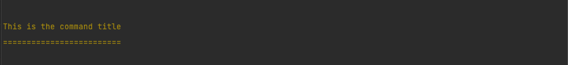

---

#### Section

The `section()` method can be used to separate multiple coherent sections of a command

```php
$io->section('This is a new section');
```

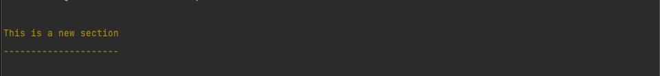

---

#### Info

The `info()` method can be used signalize successful completion of a section.

```php
$io->info('This is an info');
```

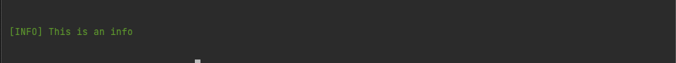

---

#### Note

The `note()` method can be used to draw extra attention to the message. Use this sparingly.

```php
$io->note('This is a note');
```

---

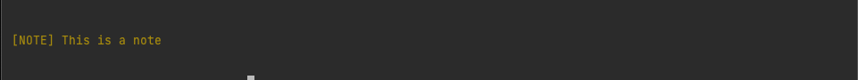

#### Text

The `text()` method output regular text without colorization.

```php
// Passing an array is optional.
$io->text(['This is a text', 'This is another text']);
```

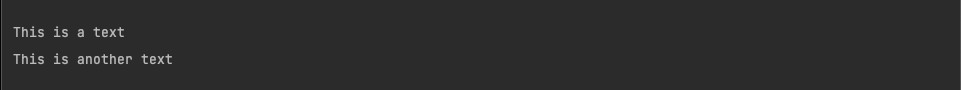

---

#### Success

The `success()` method should be used once at the end of a command.

```php
// Passing an array is optional.
$io->success(['This command', 'was successful']);
```

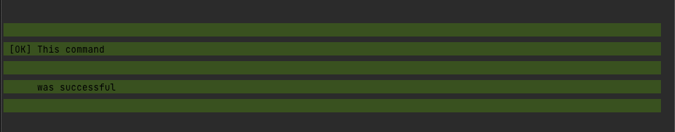

--- 

#### Warning

The `warning()` method should be used once at the end of a command.

```php
// Passing an array is optional.
$io->warning(['This command', 'displays a warning']);
```

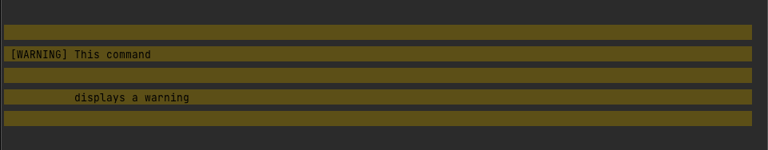

---

#### Error

The `error()` method should be used once at the end of a command if it failed.

```php
// Passing an array is optional.
$io->error(['This command', 'did not work']);
```


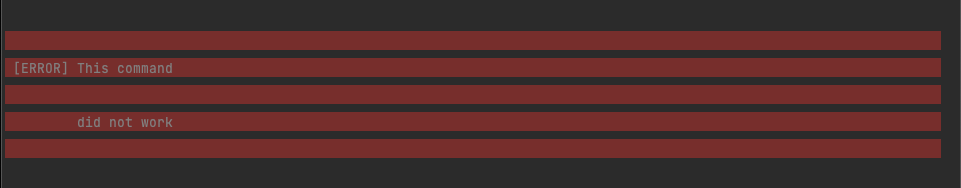

---


### Interactive input

The [`SniccoStyle`](src/Style/SniccoStyle.php) class provides several methods to
get more information from the user.

If the command was run with the `--no-interaction` flag the default answer will be used automatically.
See: [default flags](#default-flags).

All output produced by interactive questions is written to `STDERR`.

---

#### Asking for confirmation

```php
use Snicco\Component\BetterWPCLI\Command;
use Snicco\Component\BetterWPCLI\Style\SniccoStyle;
use Snicco\Component\BetterWPCLI\Input\Input;
use Snicco\Component\BetterWPCLI\Output\Output;

   // ... 
   protected function execute(Input $input, Output $output): int
    {
        $io = new SniccoStyle($input, $output);
        
        // The second argument is the default value
        if(!$io->confirm('Are you sure that you want to continue', false)) {
        
            $io->warning('Command aborted');
            
            return Command::SUCCESS;
        }
        // Proceed
        
        return Command::SUCCESS;
    }

```

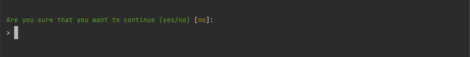

---

#### Asking for information

```php
use Snicco\Component\BetterWPCLI\Command;
use Snicco\Component\BetterWPCLI\Style\SniccoStyle;
use Snicco\Component\BetterWPCLI\Input\Input;
use Snicco\Component\BetterWPCLI\Output\Output;

   // ... 
   protected function execute(Input $input, Output $output): int
    {
        $io = new SniccoStyle($input, $output);
        
        $domain = $io->ask('Please tell use your company domain', 'snicco.io');
        
        $output->writeln('Your domain is: '. $domain);
    }
```

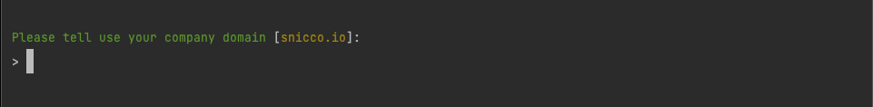

---


#### Hidden input

You can also ask a question and hide the response.

This will be done by changing the `stty` mode of the terminal.

If `stty` is not available, it will fall back to visible input unless you configure it otherwise.

```php
use Snicco\Component\BetterWPCLI\Command;
use Snicco\Component\BetterWPCLI\Style\SniccoStyle;
use Snicco\Component\BetterWPCLI\Input\Input;
use Snicco\Component\BetterWPCLI\Output\Output;
use Snicco\Component\BetterWPCLI\Output\Output;
use Snicco\Component\BetterWPCLI\Question\Question;

   // ... 
   protected function execute(Input $input, Output $output): int
    {
        $io = new SniccoStyle($input, $output);
        
        // This will fall back to visible input if stty is not available.
        // e.g. on Windows
        $secret = $io->askHidden('What is your secret?')
        
        $question = (new Question('What is your secret'))
                        ->withHiddenInput()
                        ->withFallbackVisibleInput(false);
        
        // This will throw an exception if hidden input can not be ensured.
        $secret = $io->askQuestion($question);
        
        //
    }
```

---

#### Validating the provided input

You can validate the provided answer of the user. If the validation fails
the user will be presented with the same question again.

You can also set a maximum amount of attempts. If the maximum attempts are exceeded
an [InvalidAnswer](src/Exception/InvalidAnswer.php) exception will be thrown.

```php
use Snicco\Component\BetterWPCLI\Command;
use Snicco\Component\BetterWPCLI\Style\SniccoStyle;
use Snicco\Component\BetterWPCLI\Input\Input;
use Snicco\Component\BetterWPCLI\Output\Output;
use Snicco\Component\BetterWPCLI\Output\Output;
use Snicco\Component\BetterWPCLI\Question\Question;
use Snicco\Component\BetterWPCLI\Exception\InvalidAnswer;

   // ... 
   protected function execute(Input $input, Output $output): int
    {
        $io = new SniccoStyle($input, $output);
        
        $validator = function (string $answer) :void {
            if(strlen($answer) < 5) {
                throw new InvalidAnswer('The name must have at least 6 characters.');
            }
        };
        
        $attempts = 2; 
                
        $question = new Question('Please enter a name', 'default_name', $validator, $attempts);
        
        $answer = $io->askQuestion($question);
    }
```

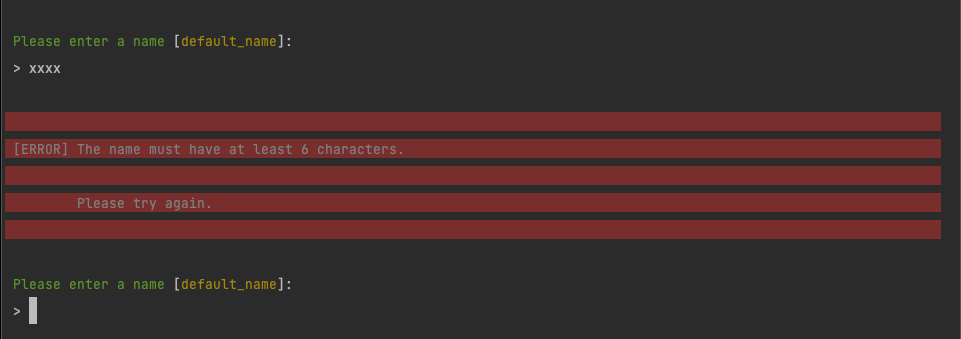

---

### Exception handling

**BetterWPCLI** comes with very solid exception/error-handling.

This behaviour is however totally isolated and only applies to **YOUR** commands.
Core commands or commands by other plugins are not affected in any way.

---

#### Uncaught exceptions

If your command throws an uncaught exception two things will happen:

1. The exception is displayed in `STDERR` while taking the current [verbosity](#verbosity-levels) into consideration.
2. The exception is [logged](#logging) using the [`Logger`](src/Logger/Logger.php) interface. (This is the third argument passed into the [`WPCLIApplication`](src/WPCLIApplication.php))

This is how exceptions are displayed with different verbosity levels:

`VERBOSTIY::NORMAL`:

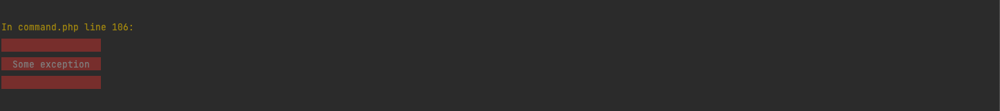


`VERBOSTIY::VERBOSE`:

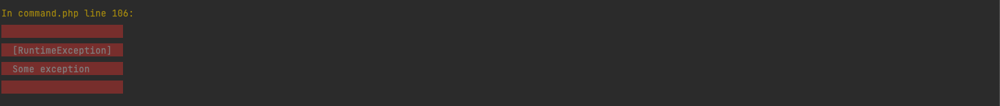

`VERBOSTIY::VERY_VERBOSE` and above:

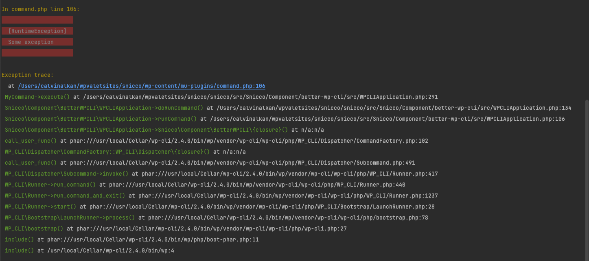

You can disable catching exceptions although this is not recommended.

```php
use Snicco\Component\BetterWPCLI\WPCLIApplication;;

$command_loader = new ArrayCommandLoader($command_classes, $factory);

$application = new WPCLIApplication($command_namespace);

// This disables exception handling.
//All exceptions are now handled globally by WordPress again.
$application->catchException(false);

$application->registerCommands();
```

---

#### Logging

By default a [`StdErrLogger`](src/Logger/StdErrLogger.php) is used to log exceptions using `error_log`.

This class is suitable for usage in distributed code as it will log exceptions to the location 
configured in `WP_DEBUG_LOG`. If you want to use a custom logger you have to pass it as the third argument
when creating your [`WPCLIApplication`](src/WPCLIApplication.php).

The [`Logger`](src/Logger/Logger.php) will create a log record for all uncaught exceptions during your command lifecycle + all commands that return a non-zero exit code.

---

#### Converting errors to exceptions

In a normal `WP-CLI` command [errors](https://www.php.net/manual/en/function.error-reporting.php) such as notices, warnings and deprecations
are not handled at all. Instead, they bubble up to the global **PHP** error handler.

It is a best practice to treat notices and warnings as exceptions.

**BetterWPCLI** will promote all errors during **YOUR** command to instances of `ErrorException`.

The following code:

```php
use Snicco\Component\BetterWPCLI\Command;
use Snicco\Component\BetterWPCLI\Style\SniccoStyle;
use Snicco\Component\BetterWPCLI\Input\Input;
use Snicco\Component\BetterWPCLI\Output\Output;

   // ... 
   protected function execute(Input $input, Output $output): int
    {
        $arr = ['foo'];
        
        $foo = $arr[1];
        
        //
        
        return Command::SUCCESS;
    }

```

will throw an exception and exit with code `1`.

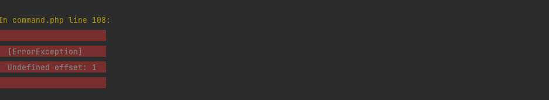

By default, all error including deprecations are promoted to exceptions.

If you find this to strict for your production environment you can customize the behaviour.

```php
use Snicco\Component\BetterWPCLI\WPCLIApplication;;

$command_loader = new ArrayCommandLoader($command_classes, $factory);

$application = new WPCLIApplication($command_namespace);

// This is the default setting
$application->throwExceptionsAt(E_ALL);

// Throw exceptions for all errors expect deprecations.
$application->throwExceptionsAt(E_ALL - E_DEPRECATED - E_USER_DEPRECATED);

// This disables the behaviour entirely (NOT RECOMMENDED)
$application->throwExceptionsAt(0);

$application->registerCommands();
```

---

## Contributing

This repository is a read-only split of the development repo of the 
[**Snicco** project](https://github.com/snicco/snicco).

[This is how you can contribute](https://github.com/snicco/snicco/blob/master/CONTRIBUTING.md).

## Reporting issues and sending pull requests

Please report issues in the
[**Snicco** monorepo](https://github.com/snicco/snicco/blob/master/CONTRIBUTING.md##using-the-issue-tracker).

## Security

If you discover a security vulnerability within **BetterWPAPI**, please follow
our [disclosure procedure](https://github.com/snicco/snicco/blob/master/SECURITY.md).

## Credits

Inspecting the source of the symfony console [`symfony/console`](https://github.com/symfony/console) was invaluable to developing this library.